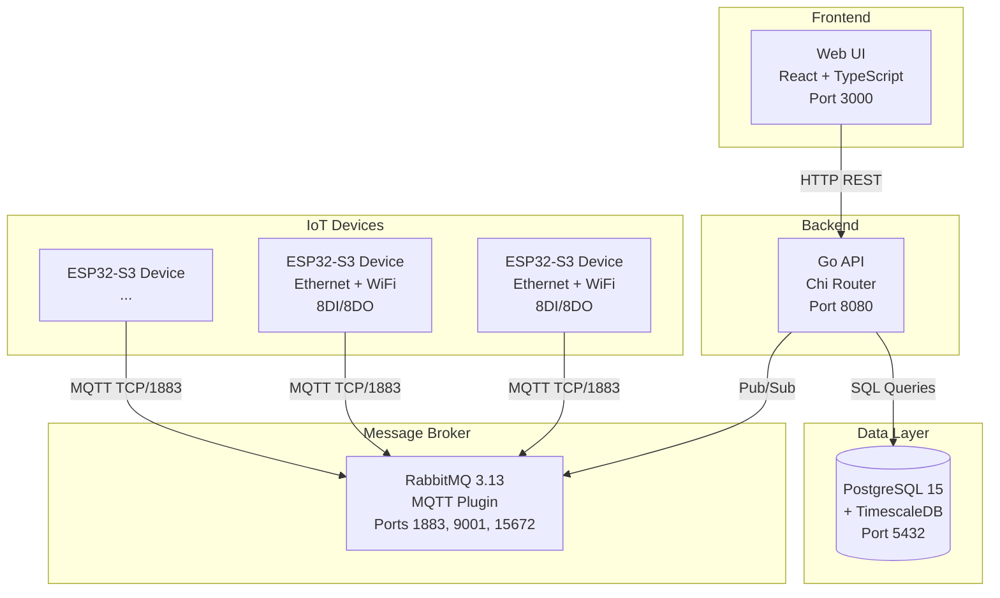

# System Architecture

## Overview

Assembly Line Manager is a distributed IoT system designed for real-time monitoring and control of manufacturing production lines. The system combines modern web technologies with embedded hardware to provide comprehensive production line management.

## Architecture Diagram

## Components

### API (Go Backend)
- **Language**: Go 1.22+
- **Framework**: Chi v5 HTTP router
- **Port**: 8080
- **Responsibilities**:
  - REST API endpoints for production lines, schedules, devices, analytics, compliance
  - MQTT event publishing (line events)
  - MQTT command subscription (status commands, device announcements)
  - Business logic layer (services)
  - Data access layer (repositories)
  - Device discovery and management

### Web UI (React Frontend)
- **Language**: TypeScript + React 18
- **Build Tool**: Vite
- **Port**: 3000 (production), 5173 (development)
- **Responsibilities**:
  - Real-time dashboard with auto-refresh
  - Production line CRUD operations
  - Schedule management (weekly, holidays, exceptions)
  - Analytics dashboard (uptime, MTTR, compliance)
  - Device discovery and assignment
  - Responsive mobile-first design

### Firmware (ESP32-S3 Embedded)
- **Platform**: Waveshare ESP32-S3-POE-ETH-8DI-8DO
- **Language**: C++17 (Arduino framework)
- **Build Tool**: PlatformIO
- **Responsibilities**:
  - Device announcement via MQTT
  - Digital input monitoring (8 channels)
  - Digital output control (8 channels via I2C)
  - Ethernet connectivity (W5500 with POE)
  - WiFi connectivity (Station + AP modes)
  - Device identification (LED + buzzer)
  - NVS configuration storage

### PostgreSQL + TimescaleDB
- **Version**: PostgreSQL 15 with TimescaleDB extension
- **Port**: 5432 (internal only)
- **Database**: `production_lines`
- **Responsibilities**:
  - Production line records
  - Status audit trail (TimescaleDB hypertable)
  - Schedule definitions and exceptions
  - Device registry and assignments
  - Compliance metrics
  - Label management

### RabbitMQ (Message Broker)
- **Version**: 3.13 with MQTT plugin
- **Ports**:
  - 1883: MQTT TCP
  - 9001: MQTT WebSocket
  - 15672: Management UI
  - 5672: AMQP (optional)
- **Credentials**: guest/guest (default)
- **Responsibilities**:
  - MQTT broker for device-API communication
  - Event distribution (line created/updated/deleted)
  - Command routing (status changes, device commands)
  - Topic-based publish/subscribe

## Data Flow

### Device Discovery Flow
1. ESP32-S3 device boots and connects to network (Ethernet or WiFi)
2. Device announces itself on `devices/announce` topic (every 60s)
3. API subscribes to device topics and receives announcement
4. API stores device in `discovered_devices` table
5. Web UI polls API and displays device in discovery page
6. User clicks "Flash" button → API publishes command → Device blinks LED
7. User assigns device to line → API stores mapping → Future events from device update line status

### Line Status Change Flow
1. User changes line status in Web UI
2. Web UI sends POST request to API (`/api/v1/lines/{id}/status`)
3. API updates database and records in status_log (TimescaleDB)
4. API publishes event to `production-lines/events/status` topic
5. Subscribed devices or controllers receive event
6. Web UI refetches data (TanStack Query) and updates display

### Device Input Change Flow
1. Digital input state changes on ESP32-S3
2. Device publishes to `devices/{MAC}/input-change` topic
3. API receives event and checks device assignment
4. If device is assigned to a line, API updates line status
5. API publishes line status event
6. Web UI receives update on next poll

## Network Ports

| Service | Port | Protocol | Purpose |
|---------|------|----------|---------|
| API | 8080 | HTTP | REST API endpoints |
| Web UI | 3000 | HTTP | Production web interface |
| Web UI (dev) | 5173 | HTTP | Vite development server |
| PostgreSQL | 5432 | TCP | Database connections |
| RabbitMQ MQTT | 1883 | MQTT TCP | Device MQTT connections |
| RabbitMQ WebSocket | 9001 | MQTT WS | Browser MQTT connections |
| RabbitMQ Management | 15672 | HTTP | RabbitMQ admin UI |
| RabbitMQ AMQP | 5672 | AMQP | AMQP protocol (optional) |

## Technology Stack

### Backend Technologies
- **Go 1.22+**: Primary language
- **Chi v5**: HTTP router with middleware
- **pgx v5**: PostgreSQL driver
- **TimescaleDB**: Time-series extension for PostgreSQL
- **Eclipse Paho MQTT**: MQTT client library
- **Zap**: Structured logging
- **Swaggo**: Swagger/OpenAPI documentation generation

### Frontend Technologies
- **React 18**: UI framework
- **TypeScript**: Type-safe JavaScript
- **Vite**: Build tool and dev server
- **TanStack Query**: Server state management
- **React Router v6**: Client-side routing
- **Tailwind CSS**: Utility-first CSS
- **Recharts**: Analytics charting library
- **Headless UI**: Accessible UI components
- **Axios**: HTTP client
- **react-hot-toast**: Toast notifications

### Firmware Technologies
- **PlatformIO**: Build system and package manager
- **Arduino ESP32 3.0.2**: ESP32-S3 framework
- **W5500**: Ethernet controller driver
- **PubSubClient**: MQTT client library
- **ArduinoJson**: JSON serialization
- **Wire (I2C)**: TCA9554PWR I/O expander communication

### Infrastructure Technologies
- **Docker**: Containerization
- **Docker Compose**: Multi-container orchestration
- **PostgreSQL 15**: Relational database
- **TimescaleDB**: Time-series data management
- **RabbitMQ 3.13**: Message broker with MQTT plugin
- **Nginx**: Web server for production frontend

## Deployment Architecture

### Development
- All services run in Docker containers
- Volume mounts for hot reload
- Debug logging enabled
- Local PostgreSQL data persistence
- Exposed ports for all services

### Production
- Optimized Docker images (multi-stage builds)
- Environment-based configuration
- Production logging levels
- Persistent volumes for data
- Health checks and restart policies
- CORS configured for specific origins

## Scalability Considerations

### Horizontal Scaling
- **API**: Stateless design allows multiple instances behind load balancer
- **Web UI**: Static assets can be served from CDN
- **RabbitMQ**: Can be clustered for high availability

### Vertical Scaling
- **PostgreSQL**: Connection pooling (max 25 connections per API instance)
- **TimescaleDB**: Automatic partitioning with 7-day chunks
- **RabbitMQ**: Message persistence and queue limits

### Performance Optimizations
- **TimescaleDB**: Compression after 30 days for historical data
- **TanStack Query**: 5-minute client-side caching
- **Indexes**: Optimized for time-series queries on status_log
- **Connection Pooling**: Reusable database connections

## Security

### Network Security
- Internal Docker network for service communication
- Only necessary ports exposed to host
- CORS restrictions on API

### Authentication
- RabbitMQ: Username/password authentication
- PostgreSQL: Credential-based access
- API: CORS protection (future: API keys/JWT)

### Data Security
- MQTT credentials stored in device NVS
- Database passwords in environment variables
- Production secrets managed via Docker secrets or environment

## See Also

- [Getting Started Guide](./getting-started.md)
- [MQTT Topics Reference](./mqtt/topics.md)
- [MQTT Message Formats](./mqtt/message-formats.md)
- [API Documentation](../api/README.md)
- [Firmware Documentation](../firmware/README.md)
- [Web UI Documentation](../web/README.md)
